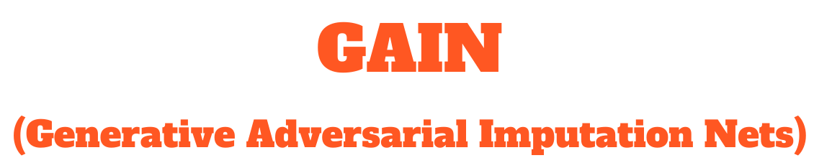

[![Contributors][contributors-shield]][contributors-url]
[![Forks][forks-shield]][forks-url]
[![Stargazers][stars-shield]][stars-url]
[![Issues][issues-shield]][issues-url]
[![MIT License][license-shield]][license-url]
[![LinkedIn][linkedin-shield]][linkedin-url]

<!-- PROJECT LOGO -->
<br />
<div align="center">
  <a href="https://github.com/javiersgjavi/GAIN-Pytorch-Lightning">
    
  </a>

  <h3 align="center">Pytorch Lightning implementation for "Generative Adversarial Imputation Networks (GAIN)"</h3>

  <p align="center">
    An implementation of the GAIN framework for imputation using Pytorch Lightning
    <br />
  </p>
</div>


<!-- TABLE OF CONTENTS -->
<details>
  <summary>Table of Contents</summary>
  <ol>
    <li>
      <a href="#about-the-project">About The Project</a>
    </li>
    <li><a href="#built-with">Built With</a></li>
    <li>
      <a href="#datasets">Datasets</a>
    </li>
    <li>
      <a href="#getting-started">Folder structure</a>
    </li>
    <li><a href="#how-to-run-it">How to run it</a></li>
    <ul>
      <li><a href="#creation-of-a-docker-container">Creation of a Docker container</a></li>
      <li><a href="#command-inputs">Command inputs</a></li>
      <li><a href="#example-command">Example command</a></li>
    </ul>
    <li><a href="#how-to-replicate-the-results-of-the-original-paper">How to replicate the results of the original paper</a></li>
    <li><a href="#license">License</a></li>
  </ol>
</details>


<a name="about-the-project"/>

## About The Project

Original authors: Jinsung Yoon, James Jordon, Mihaela van der Schaar

Paper: Jinsung Yoon, James Jordon, Mihaela van der Schaar, 
"GAIN: Missing Data Imputation using Generative Adversarial Nets," 
International Conference on Machine Learning (ICML), 2018.

- Original Github repository: https://github.com/jsyoon0823/GAIN
- Paper Link: http://proceedings.mlr.press/v80/yoon18a/yoon18a.pdf
- Supplementary material: http://proceedings.mlr.press/v80/yoon18a/yoon18a-supp.pdf

<a name="built-with"/>

## Built With :hammer:


<a name="datasets"/>

## Datasets
This directory contains implementations of GAIN framework for imputation
using the main five datasets used in the original paper:

-   UCI Letter (https://archive.ics.uci.edu/ml/datasets/Letter+Recognition)
-   UCI Spam (https://archive.ics.uci.edu/ml/datasets/Spambase)
-   UCI Credit (https://archive.ics.uci.edu/ml/datasets/default+of+credit+card+clients)
-   UCI Breast Cancer (https://archive.ics.uci.edu/ml/datasets/Breast+Cancer+Wisconsin+(Diagnostic))
-   UCI Online News Popularity (https://archive.ics.uci.edu/ml/datasets/Online+News+Popularity)

<a name="folder-structure"/>

## Folder structure

    .
    ├── data                        # Contains the raw data
    ├── docker                      # Contains the files to create a Docker container
    ├── src                         # Source files 
    │   ├── data                    # Scripts to load and preprocess data
    │   └──  models                 # Scripts that define the GAIN model, the training loop and the MLP base for GAIN
    ├── reports                     # Folder generated by running, contains the results of the experiments (Tensorboard logs, etc...)
    ├── main.py                     # Main script to run an experiment
    ├── replicate_table1_paper.py   # Script to replicate the results of the table 1 of the original paper, saves the results in a reports folder
    ├── setup.sh                    # Script that creates a Docker container
    ├── requirements.txt            # Requirements file
    ├── logo.png                    # Logo used in the README
    ├── LICENSE
    └── README.md

<a name="how-to-run-it"/>

## How to run it

To run the pipeline for training and evaluation on GAIN framework, simply run 
``python3 -m main.py``.

Note that any model architecture can be used as the generator and 
discriminator model such as multi-layer perceptrons or CNNs. 


<a name="creation-of-a-docker-container"/>

### Creation of a Docker container:

If you want to run the code in a Docker container, you can use the following commands:

1. Give execution permissions to the setup.sh file:
```shell
$ chmod +x setup.sh
```
2. Run the setup.sh file:

```shell
$ ./setup.sh
```

If you have exited the container, you can access it again by running the setup.sh file again.

<a name="command-inputs"/>

### Command inputs:

-   ``data_name``: letter, spam, credit, breast or news
-   ``miss_rate``: probability of missing components
-   ``batch_size``: batch size
-   ``hint_rate``: hint rate
-   ``alpha``: hyperparameter
-   ``iterations``: iterations

<a name="example-command"/>

### Example command

```shell
$ python3 main.py --data_name spam 
--miss_rate: 0.2 --batch_size 128 --hint_rate 0.9 --alpha 100
--iterations 10000
```

<a name="how-to-replicate-the-results-of-the-original-paper"/>

## How to replicate the results of the original paper:

If you want to replicate the results of the table 1 of the original paper, you can use the following command:

```shell
$ python3 replicate_table1_paper.py
```

## License
This project is licensed under the Apache License 2.0 - see the LICENSE file for details


[contributors-shield]: https://img.shields.io/github/contributors/javiersgjavi/GAIN-Pytorch-Lightning.svg?style=for-the-badge
[contributors-url]: https://github.com/javiersgjavi/GAIN-Pytorch-Lightning/graphs/contributors
[forks-shield]: https://img.shields.io/github/forks/javiersgjavi/GAIN-Pytorch-Lightning.svg?style=for-the-badge
[forks-url]: https://github.com/javiersgjavi/GAIN-Pytorch-Lightning/network/members
[stars-shield]: https://img.shields.io/github/stars/javiersgjavi/GAIN-Pytorch-Lightning.svg?style=for-the-badge
[stars-url]: https://github.com/javiersgjavi/GAIN-Pytorch-Lightning/stargazers
[issues-shield]: https://img.shields.io/github/issues/javiersgjavi/GAIN-Pytorch-Lightning.svg?style=for-the-badge
[issues-url]: https://github.com/javiersgjavi/GAIN-Pytorch-Lightning/issues
[license-shield]: https://img.shields.io/github/license/javiersgjavi/GAIN-Pytorch-Lightning.svg?style=for-the-badge
[license-url]: https://github.com/javiersgjavi/GAIN-Pytorch-Lightning/blob/master/LICENSE
[linkedin-shield]: https://img.shields.io/badge/-LinkedIn-black.svg?style=for-the-badge&logo=linkedin&colorB=555
[linkedin-url]: https://linkedin.com/in/javier-solis-garcia/